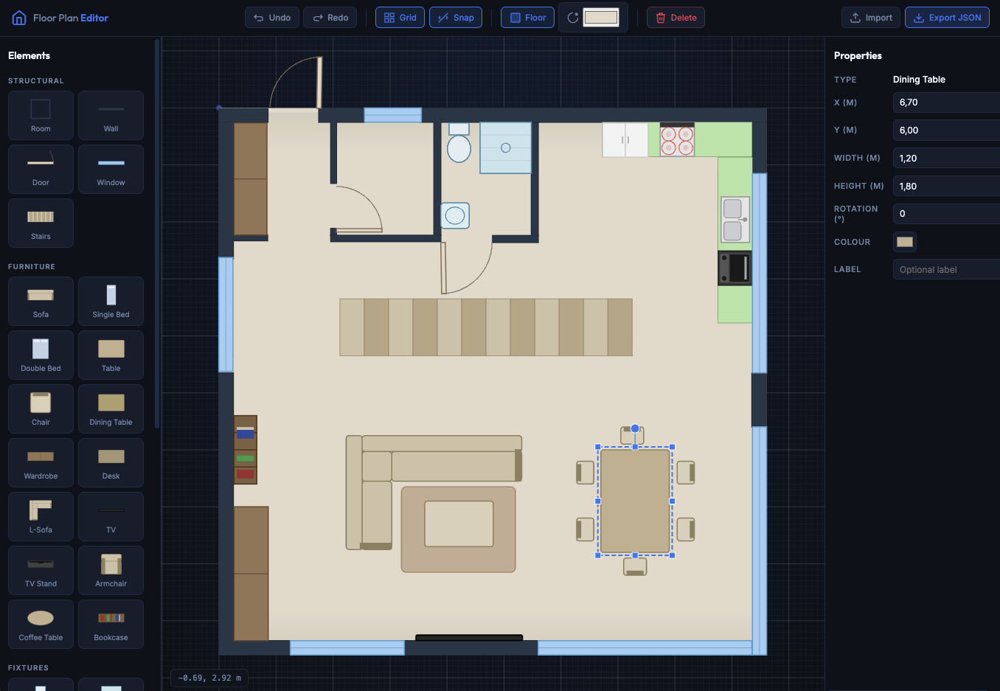

# 🏠 Visual Floor Plan Editor



A modern, high-performance 2D floor plan designer built with **TypeScript**, **Canvas API**, and **Vite**. Create professional-looking architectural layouts with ease using an intuitive drag-and-drop interface.

---

## ✨ Features

- **🧩 Extensive Catalog**: Predefined elements including walls, doors, windows, stairs, furniture (sofas, beds, tables), and fixtures (toilets, showers, sinks).
- **🖱️ Intuitive Editing**:
  - Drag and drop to position elements.
  - Scale and rotate with precision handles.
  - Interactive property panel for fine-tuning dimensions, colors, and labels.
- **🧲 Smart Snapping**:
  - **Grid Snapping**: Align elements to a predefined grid.
  - **Magnetic Snapping**: Automatically align edges and centers with nearby elements for perfect architecture.
- **⏪ Undo/Redo**: Full history support for a worry-free design experience.
- **📥 Import/Export**: Save your designs as JSON files and load them back anytime.
- **🎨 Visual Customization**: Toggle grid visibility, floor fills, and customize colors for every element.
- **⌨️ Keyboard Shortcuts**: Familiar controls like `Ctrl+Z` (Undo), `Ctrl+Y` (Redo), `Del` (Delete), and `Ctrl+C/V` (Copy/Paste).

---

## 🛠️ Technology Stack

- **Frontend**: [TypeScript](https://www.typescriptlang.org/)
- **Rendering**: [HTML5 Canvas API](https://developer.mozilla.org/en-US/docs/Web/API/Canvas_API)
- **Build Tool**: [Vite](https://vitejs.dev/)
- **Icons**: [Lucide](https://lucide.dev/)
- **Typography**: Outfit & Inter (Google Fonts)

---

## 🚀 Getting Started

### Prerequisites

- [Node.js](https://nodejs.org/) (v18 or higher recommended)
- [npm](https://www.npmjs.com/) or [pnpm](https://pnpm.io/)

### Installation

1. Clone the repository:
   ```bash
   git clone https://github.com/sirakav/floor-planner.git
   cd floor-planner
   ```

2. Install dependencies:
   ```bash
   npm install
   ```

3. Start the development server:
   ```bash
   npm run dev
   ```

4. Open your browser and navigate to `http://localhost:5173`.

---

## 📂 Project Structure

```text
├── src/
│   ├── main.ts        # Core application logic & Canvas rendering
│   ├── style.css      # Modern UI styling (glassmorphism & flex layout)
│   └── vite-env.d.ts  # Type definitions
├── public/            # Static assets and sample floors
├── index.html         # Main entry point & UI structure
├── package.json       # Dependencies and scripts
└── tsconfig.json      # TypeScript configuration
```

---

## 📖 How to Use

1. **Add Elements**: Click on any item in the left-side palette to place it on the canvas.
2. **Select & Modify**: Click an element on the canvas to select it. Use the right-side properties panel to change its size, rotation, or color.
3. **Move & Resize**: Drag the element to move it. Drag the white circular handles on the corners/edges to resize.
4. **Snapping**: Use the top toolbar to toggle Grid and Magnetic snapping for precise alignment.
5. **Save Your Work**: Click "Export JSON" to download your floor plan. You can reload it later using the "Import" button.

---

## 🌟 License

This project is licensed under the MIT License - see the LICENSE file for details.
